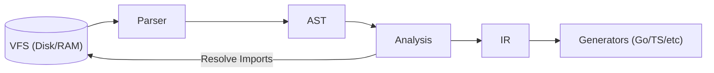

# Compiler Core

This directory contains the **core language logic** for UFO RPC. It is responsible for reading, parsing, validating, and transforming `.ufo` source files into a format ready for code generation.

The core is designed as a strict pipeline. No external tools (LSP, CLI, Generators) should interact with the raw source code, they must consume the artifacts produced here.

## Architecture & Data Flow

The compilation process moves linearly through these four packages:

## Package Overview

### `vfs` (Virtual File System)

**"The I/O Abstraction Layer."**

- **Responsibility:** Provides a unified, thread-safe way to read source files. It acts as the bridge between the Operating System and the Compiler.

**Key Features:**

- **Memory Caching:** Caches disk reads to avoid repeated syscalls during analysis.
- **Dirty Buffers (LSP):** Supports in-memory file overlays (`WriteFileCache`), allowing the compiler to analyze unsaved changes in the editor before they exist on disk.
- **Cache Invalidation:** Supports removing cached files (`RemoveFileCache`) when files are saved or closed in the editor.
- **Path Resolution:** Handles canonical absolute paths (`Resolve`), ensuring consistent file identity across different operating systems.

### `ast` (Abstract Syntax Tree)

**"How the code is written."**

- **Responsibility:** Defines the data structures that represent the raw syntactic structure of a `.ufo` file.
- **Contents:** Node definitions (e.g., `Schema`, `RPCDecl`, `TypeDecl`, `EnumDecl`, `ConstDecl`, `PatternDecl`).

**Characteristics:**

- **Dirty:** Contains syntax noise like quotes (`"string"`), positions, and comments.
- **Hierarchical:** Represents the exact nesting of the source file.
- **Passive:** Just data structs. No logic.
- **Position Tracking:** Every node embeds `Positions` (start/end line and column) for LSP features and error reporting.

**Primitive Types:** `string`, `int`, `float`, `bool`, `datetime`.

### `parser`

**"From Text to Tree."**

- **Responsibility:** Converts raw bytes (source code) into an `ast.Schema`.
- **Technology:** Built on the [participle](https://github.com/alecthomas/participle) parser-combinator library.

**Contents:**

- **Lexer:** Tokenizes input using regex-based rules. Keywords have priority over identifiers.
- **Parser:** Validates **syntax** only (e.g., matching braces, valid keywords). Uses lookahead to distinguish attached from standalone docstrings.

- **Input:** `.ufo` file content (bytes).
- **Output:** `*ast.Schema` or Syntax Errors (`parser.Error`).

### `analysis`

**"The Semantic Brain."**

- **Responsibility:** Understands and validates the **meaning** of the code across the entire project. This is the engine that powers the **LSP**.

**Contents:**

- **Resolver:** Parses the entry point, recursively resolves `include` statements, detects circular dependencies, and inlines external markdown docstrings.
- **Symbol Table:** Collects and registers all types, enums, constants, patterns, and RPCs into a global namespace.
- **Validators:** Modular validation passes for:
  - Naming conventions (PascalCase, camelCase, UPPER_SNAKE_CASE)
  - Type references (undefined types, spreads)
  - Enum consistency (mixed types, duplicate values)
  - Pattern syntax (invalid placeholders)
  - RPC structure (duplicate procs/streams)
  - Cycle detection (circular type dependencies)
  - Global uniqueness (cross-category name collisions)
- **Diagnostics:** Errors are reported as `Diagnostic` with file, position, error code (e.g., `E001`), and message.

**Key Design:** Uses a **best-effort strategy** — always returns a `Program` that is as complete as possible, even when errors are found. This enables LSP features (hover, go-to-definition, completions) to remain functional in files with errors.

- **Input:** Entry point file path.
- **Output:** `*analysis.Program` (A validated graph of symbols and files) + `[]Diagnostic`.

### `ir` (Intermediate Representation)

**"The Blueprint for Generation."**

- **Responsibility:** Transforms the complex analysis graph into a clean, flat model optimized for code generators.

**Design Principles:**

- **Source Amnesia:** No line numbers, file paths, or AST references. Generators don't need source context.
- **Aggressive Flattening:** Spreads (`...Audit`) are fully expanded; generators see flat field lists.
- **Deterministic Order:** All collections are sorted alphabetically for reproducible output.
- **Serializable:** Designed for JSON export (`ToJSON()`), useful for the WASM playground and writing tests.

**Contents:**

- **Flattening:** Spreads are resolved, fields are copied into the final struct.
- **Doc Normalization:** Docstrings are trimmed and dedented for consistent formatting.

- **Input:** `*analysis.Program`.
- **Output:** `*ir.Schema` (The "Golden Copy" used by `codegen/golang`, `codegen/typescript`, etc.).

---

## Quick Reference

| Feature       | `ast`                     | `analysis`          | `ir`                      |
| ------------- | ------------------------- | ------------------- | ------------------------- |
| **Scope**     | Single File               | Entire Project      | Optimized for Output      |
| **Includes**  | Raw Strings (`"./a.ufo"`) | Resolved Graph      | Merged/Invisible          |
| **Spreads**   | Reference (`...Base`)     | Resolved Pointer    | Copied Fields (Flattened) |
| **Docs**      | Raw (`""" ./doc.md """`)  | Validated/Inlined   | Normalized Content        |
| **Positions** | Full (line, column)       | Full (for LSP)      | None (Source Amnesia)     |
| **Errors**    | Syntax Errors             | Diagnostics (codes) | None (assumes valid)      |
| **Used By**   | Parser, Formatter         | LSP, IR Builder     | Generators                |
