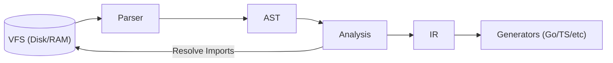

# Compiler Core

This directory contains the **core language logic** for UFO RPC. It is responsible for reading, parsing, validating, and transforming `.ufo` source files into a format ready for code generation.

The core is designed as a strict pipeline. No external tools (LSP, CLI, Generators) should interact with the raw source code, they must consume the artifacts produced here.

## Architecture & Data Flow

The compilation process moves linearly through these four packages:

## Package Overview

### `vfs` (Virtual File System)

**"The I/O Abstraction Layer."**

- **Responsibility:** Provides a unified, thread-safe way to read source files. It acts as the bridge between the Operating System and the Compiler.

**Key Features:**

- **Memory Caching:** Caches disk reads to avoid repeated syscalls during analysis.
- **Dirty Buffers (LSP):** Supports in-memory file overlays (`WriteFileCache`), allowing the compiler to analyze unsaved changes in the editor before they exist on disk.
- **Path Resolution:** Handles canonical absolute paths (`Resolve`), ensuring consistent file identity across different operating systems.

### `ast` (Abstract Syntax Tree)

**"How the code is written."**

- **Responsibility:** Defines the data structures that represent the raw syntactic structure of a `.ufo` file.
- **Contents:** Node definitions (e.g., `Schema`, `RPCDecl`, `TypeDecl`).

**Characteristics:**

- **Dirty:** Contains syntax noise like quotes (`"string"`), positions, and comments.
- **Hierarchical:** Represents the exact nesting of the source file.
- **Passive:** Just data structs. No logic.

### `parser`

**"From Text to Tree."**

- **Responsibility:** Converts raw bytes (source code) into an `ast.Schema`.

**Contents:**

- **Lexer:** Breaks text into tokens (lives here internally).
- **Parser:** Validates **syntax** only (e.g., matching braces, valid keywords).

- **Input:** `.ufo` file content (bytes).
- **Output:** `*ast.Schema` or Syntax Errors.

### `analysis`

**"The Semantic Brain."**

- **Responsibility:** Understands and validates the **meaning** of the code across the entire project. This is the engine that powers the **LSP**.

**Contents:**

- **Symbol Table:** Resolves names (e.g., links `User` field to `type User`).
- **Type Checker:** Validates logical rules (e.g., "cannot use `int` as `string`", "file not found").
- **Import Graph:** Resolves `include` statements and handles circular dependencies.
- **Inlining:** External markdown docs (`./docs/intro.md`) are read and embedded as plain strings.

- **Input:** Root `*ast.Schema`.
- **Output:** `*analysis.Program` (A validated graph of symbols and files) + Semantic Errors.

### `ir` (Intermediate Representation)

**"The Blueprint for Generation."**

- **Responsibility:** Transforms the complex analysis graph into a clean, flat model optimized for code generators.

**Contents:**

- **Flattening:** Spreads (`...Audit`) are resolved, fields are copied into the final struct.
- **Normalization:** Pattern macros are expanded into concrete function signatures.

- **Input:** `*analysis.Program`.
- **Output:** `*ir.Schema` (The "Golden Copy" used by `gen/golang`, `gen/typescript`, etc.).

---

## Quick Reference

| Feature      | `ast`                     | `analysis`       | `ir`                      |
| ------------ | ------------------------- | ---------------- | ------------------------- |
| **Scope**    | Single File               | Entire Project   | Optimized for Output      |
| **Includes** | Raw Strings (`"./a.ufo"`) | Resolved Graph   | Merged/Invisible          |
| **Spreads**  | Reference (`...Base`)     | Resolved Pointer | Copied Fields (Flattened) |
| **Docs**     | Raw (`""" ./doc.md """`)  | Validated Path   | Inlined Content           |
| **Used By**  | Parser, Formatter         | LSP, IR Builder  | Generators                |
